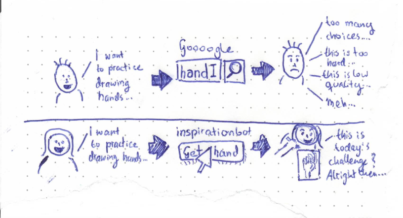
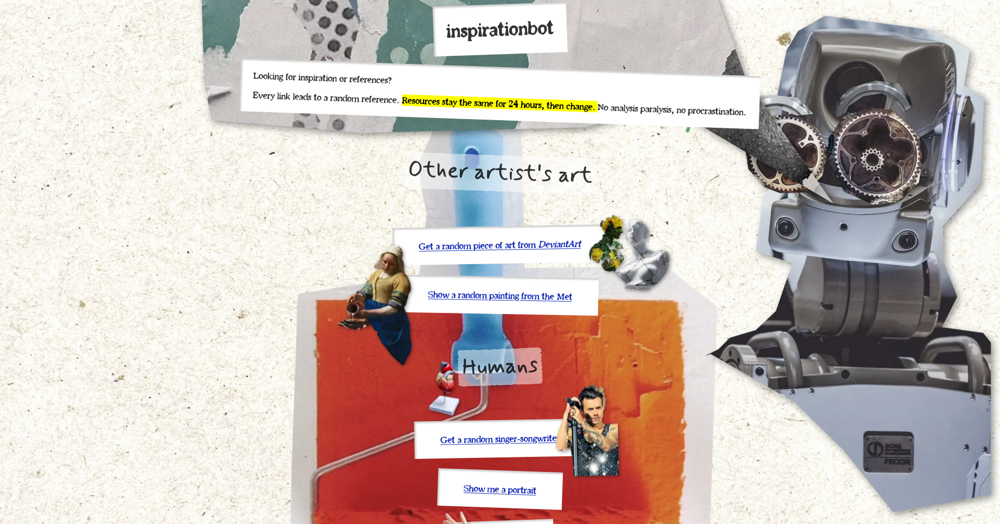
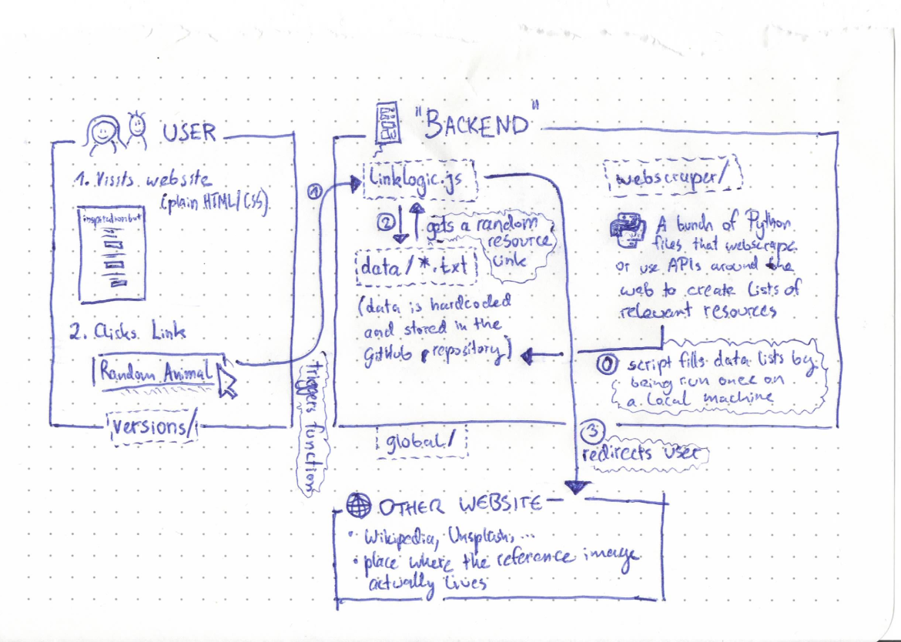

# inspirationbot



***inspirationbot* is a website that links to random art references by topic. You can use it to improve your skill at painting, drawing or sketching.**

It is available at <https://inspirationbot.art/> - go check it out!

 Free, no signup, no ads. It looks like this:



*inspirationbot* is also a sandbox for creative web design. As such, there exist several visually different versions of the site - currently there are four, with many more to come. You are welcome to add your own. Here is a list of all versions that currently exist:

* [Collage](https://inspirationbot.art/versions/collage/main.html)
* [Version 2](https://inspirationbot.art/versions/2/main.html)
* [De Stijl](https://inspirationbot.art/versions/destijl/main.html)
* [Plain HTML](https://inspirationbot.art/versions/plainhtml/main.html)

## About

I started *inspirationbot* as an attempt to build something fun and useful with good ol' plain HTML. It's playful, not entirely serious, but nonetheless intends to be useful: Finding good references for art practice is a real problem of mine, and this is my attempt to solve it. I hope you find it as useful as I do!

## Contributing, Feedback, Problems, Ideas

Any kind of contribution is welcome!

Do you have any kind of idea, question, message or feature you love, hate, would love to see or discuss? Head over to the [issues tab](https://github.com/koljapluemer/inspirationbot/issues) and let me know.

Of course, the biggest gift you can give is contributing code, documentation or tests to the project itself, which you do via a [pull request](https://docs.github.com/en/pull-requests/collaborating-with-pull-requests/proposing-changes-to-your-work-with-pull-requests/creating-a-pull-request). Your own ideas are welcome, as is picking up an issue [from the list](https://github.com/koljapluemer/inspirationbot/issues).
Feel free to comment on the issue you intend to work on first or to open a new one.

You are welcome to (ab)use this project as programming practice of any kind, clone it, adapt it and of course contribute to it. I'll give my very best to steadily extend the guidance and documentation of *inspirationbot*; if you are stuck in any way, do feel free to open an issue.

*Before you contribute, kindly read the short guidelines below:*

## Guidelines

* Remember the human.
* No personal attacks or insults, including racism, sexism, homophobia etc. Don't be an asshole.
* This a place for artists and programmers alike, of all skill levels. Be welcoming!
* In discussion, use the [Star-Man approach](https://centerforinquiry.org/blog/how-to-star-man-arguing-from-compassion/).
* Art may be political, provocative and many other things. That's a given. However, do not abuse this project as a marketing platform, a hub for politics or to spread a certain message (besides of "art practice is cool"). Keep it on-topic.

## Running the Project Locally

*inspirationbot* is currently made entirely from HTML, CSS, JavaScript, Python and plain text files. Most code is very simple, self-contained, uses few libraries and no frameworks.

If you want to play around with the project, simply [clone the repository](https://docs.github.com/en/repositories/creating-and-managing-repositories/cloning-a-repository) and read the next section to see what's what.

### Structure



The project has essentially two big components: 

1. The part that the user sees
2. Various components in the back that make the site work

Depending on what you are interested in, you don't necessarily need to wrap your head around the whole project. The user-facing part of *inspirationbot* lives exclusively in `index.html` and the `versions/` folder and is written entirely in HTML, CSS and a tiny bit of vanilla JavaScript.

Without ever leaving `versions`, you can:

* change and extend the appearance of the site
* add your own design to the site
* fix typos, improve wording and do other minor edits
* experiment with the user interface

With that in mind, here is an explanation on what you will find in each directory of the project:

#### versions/

Each folder in `versions/` is, essentially, its own self-contained website. 

Every version of the site has its own folder in `versions/`, for example, the [collage version](https://inspirationbot.art/versions/collage/main.html) lives in `versions/collage/`. All the components that a user sees when they visit a given version are contained within the respective folder: HTML files, CSS, assets (like images or fonts) and sometimes JavaScript. As such, some directories in `versions/` are slimmer than others: `plainhtml/` contains only a single file, while version `2/` has its own JavaScript among other assets.

You can edit these files in any kind of text editor or programming environment, like [Visual Studio Code](https://code.visualstudio.com). To see the effect, simply open the files in your browser (e.g., `right click` > `open in Google Chrome`).

Again, this is all you need to play around with the visual side of the project!

#### global/

The `global/` directory holds files that make the user-facing site work. If you check any HTML file, like `versions/collage/main.html`, and take a close look at the link tags (`<a>`), you can see that they are no ordinary links. Instead, they bear the curious property `onclick="getRandomLink('unsplash_portrait')"`. This means that if you click them, the `getRandomLink()` function in the file `global/javascript/linklogic.js` is called.

In turn, this function selects a random link from the relevant list in `global/data` and redirects the user. That's all!

Usually, you will have no need to edit anything in this folder directly.

#### webscraper/

Maybe you already wondered where the resources that *inspirationbot* links to come from. The answer: Web scrapers!

Every file in `webscraper` is a program that opens a certain web site, clicks around and gathers data from it, much like you would (only automatically).

In this case, the data it gathers is links, specifically, links to images that are useful as resources for art practice. For example `deviantart.py` goes to the art sharing site *DeviantArt*, opens the overview with *Daily Deviations* and saves the links of the first couple hundreds of results to `global/data/deviantart.txt`.

Now, these links will get randomly chosen when a user clicks `Get a random piece of art from DeviantArt` on the site (see above)!

*Note*: Every web scraper has to be only run once, then the data it generated is committed to version control and will be accessible to the site's links henceforth. Thus, no Python file is called live on run time, and this project makes do without any kind of server setup besides the simple kind of web server needed for a static site.

##### Running a web scaper


All files in `webscraper` is a simple Python file. As such, you can run it simply with `python $FILE.py` (replace `$FILE` with the name of the file you want to run).

You do need a couple of libraries to successfully do so, notable `selenium`. If you are using `virtualenv`, you can do the following:

```
python3 -m venv .venv
source .venv/bin/activate
cd webscraper/
pip install -r requirements.txt
```

Now, everything you need is installed and you can run any of the scripts ([more on virtualenv](https://towardsdatascience.com/virtual-environments-for-absolute-beginners-what-is-it-and-how-to-create-one-examples-a48da8982d4b)).

**Before you run any script, read the following!**

##### An Important Word on Web Scraping

Before you run any of the scripts, you should be aware that the activity of *web scraping* may be illegal or otherwise forbidden in your jurisdiction! Please research the relevant information for your place of residence beforehand and be aware that you are responsible for your actions. This is a random text file on the internet and not legal advice.

Now, to the question as to whether web scraping is unethical: 

The *reason* that web scraping has such a difficult legal standing is the potential malice that can be done with it: For example, if you build a site that lists cool travel destinations, I can create a web scraper that gathers all your data, copy your service, and make money off of your work. Furthermore, my web scraper may hit your server millions of times a minute, costing you money, and so on.

That is *not* the kind of web scraper we are using here. This project literally drives traffic back to the sites it scrapes, does not copy their service or similar. So, I don't think *inspirationbot* is doing anything unethical. But again, this says nothing about whether it is legal for you to run such a program, and this is not legal advice.

#### utilities/

Various files, like the images used in this `README.md` and some experiments to optimize images. As it stands, probably not of interest.

## FAQ

### Why does *inspirationbot* require JavaScript? 

Currently, I have no better idea how to implement the random-resource-selection-on-click without having a tiny bit of client-side javascript while using only a static web site. If you have a better idea, please open an issue.

### Why does *inspirationbot* links to images instead of saving them?

Linking to images drives traffic to the site who kindly made the image available, as well as automatically giving credit to the artist (as in the case of linking to *DeviantArt*). It also spares this project of quite large storage requirements.

## Why do links stay the same for 24 hours?

If every link would redirect to a new random resource every time you click, it's very easy to fall into procrastination and choice fatigue (I tried). Instead, the linked resource can be understood as a 'daily challenge'!

### I need resources for topic X, can it be added?

Sure! Feel free to [create a PR](https://docs.github.com/en/pull-requests/collaborating-with-pull-requests/proposing-changes-to-your-work-with-pull-requests/creating-a-pull-request) or open an issue.

### Can I add my own version of the site?

You are very welcome. Clone the project and add your version in `versions/`. 

Anything goes, be creative! Your version should offer the same functionality as the other versions (click on links, get random resources) and work as a static website - that's all.

Feel free to peruse the existing versions to see how everything works - if you are stuck, open an issue at any time!

### Is nudity/NSFW allowed?

Nudity is, of course, a big part of art. Sadly, linking to any kind of NSFW content specifically may open quite a can of worms (age verification, illegal content, appropriate warnings, ...). For this reason, *inspirationbot* currently does not support NSFW content (besides the occasional nude goddess you can find in the Metropolitan Museum Of Art)